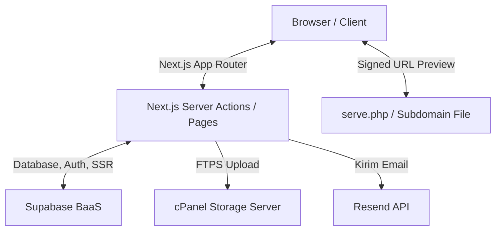

# Dokumentasi Teknis Repository KTI
### Akademi Akupunktur Aceh

Selamat datang di dokumentasi teknis sistem **Repository Karya Tulis Ilmiah (KTI) Akademi Akupunktur Aceh**. Dokumen ini dirancang untuk membantu developer memahami arsitektur, struktur kode, skema database, integrasi sistem, serta langkah-langkah deployment aplikasi.

---

## 📌 Daftar Isi
1. [Gambaran Umum & Arsitektur](#-gambaran-umum--arsitektur)
2. [Teknologi & Dependensi](#-teknologi--dependensi)
3. [Struktur Direktori Proyek](#-struktur-direktori-proyek)
4. [Skema Database & Keamanan](#-skema-database--keamanan)
5. [Sistem Penyimpanan (Dual Storage)](#-sistem-penyimpanan-dual-storage)
6. [Fitur Utama & Alur Kerja](#-fitur-utama--alur-kerja)
7. [Panduan Instalasi & Konfigurasi](#-panduan-instalasi--konfigurasi)
8. [Manajemen Akun & Role](#-manajemen-akun--role)

---

## 🏛️ Gambaran Umum & Arsitektur

Aplikasi ini merupakan platform repositori digital untuk menyimpan, mengarsipkan, dan mempublikasikan Karya Tulis Ilmiah (KTI), Skripsi, Jurnal, dan Laporan Tugas Akhir civitas akademika Akademi Akupunktur Aceh. 

Aplikasi ini dibangun menggunakan arsitektur **Serverless Modern** berbasis Next.js App Router (React 19) dan memanfaatkan Supabase sebagai Backend-as-a-Service (BaaS) untuk database, autentikasi, serta notifikasi. 



---

## 💻 Teknologi & Dependensi

Sistem ini dikembangkan dengan teknologi-teknologi mutakhir berikut:

### Core Framework & UI
* **Next.js 16.2.10 (App Router & Server Actions)**: Framework React untuk rendering server-side (SSR) dan static generation yang efisien.
* **React 19.2.4 & React DOM**: Library UI utama.
* **TailwindCSS 4.0.0**: Framework CSS utilitas terbaru untuk desain antarmuka yang modern, cepat, dan responsif.
* **Lucide React 1.23.0**: Kumpulan ikon SVG modern dan konsisten.

### Backend & Integrasi
* **Supabase (@supabase/ssr & @supabase/supabase-js)**: Menyediakan sistem Autentikasi (JWT), PostgreSQL Database, dan Row Level Security (RLS).
* **basic-ftp 6.0.1**: Digunakan untuk mengunggah file KTI secara aman via FTPS (FTP over TLS/SSL) ke server hosting cPanel eksternal.
* **Resend 6.17.2**: Layanan pengiriman email notifikasi status review KTI kepada mahasiswa/dosen.
* **Crypto (Node.js Native)**: Untuk pembuatan Signature HMAC-SHA256 untuk memvalidasi akses file PDF.

---

## 📂 Struktur Direktori Proyek

Proyek ini terstruktur secara modular mengikuti konvensi Next.js App Router:

```text
repository-kti/
├── public/                 # Aset statis (logo AAA, gambar, dll.)
├── supabase/               # Konfigurasi database lokal
│   └── schema.sql          # Skema database acuan & RLS Policies
└── src/
    ├── app/                # Next.js App Router (Halaman & Routing)
    │   ├── (auth)/         # Halaman autentikasi: /login, /register
    │   ├── admin/          # Panel Admin & Reviewer
    │   │   ├── staff/      # Pengelolaan akun staff/reviewer
    │   │   ├── users/      # Pengelolaan akun mahasiswa/dosen (baru)
    │   │   └── submission/ # Review detail KTI & checklist kelayakan
    │   ├── dashboard/      # Dashboard mahasiswa/dosen untuk melacak karya
    │   ├── detail/         # Detail halaman karya publik (metadata & abstrak)
    │   ├── request-access/ # Form permintaan akses file PDF KTI penuh
    │   ├── search/         # Pencarian KTI berbasis filter & kata kunci
    │   ├── settings/       # Pengaturan profil pengguna
    │   ├── upload/         # Form pengajuan KTI beserta berkas PDF
    │   ├── layout.tsx      # Layout utama website
    │   └── page.tsx        # Halaman landing page/beranda
    ├── components/         # Komponen UI Reusable (Navbar, Button, dll.)
    └── lib/                # Logika bisnis, helper, dan integrasi
        ├── actions/        # Server Actions (auth, admin, submissions)
        ├── supabase/       # Client & Server Creator Supabase
        ├── storage/        # Adapter FTP cPanel & Helper URL generator
        ├── helpers.ts      # Fungsi format tanggal, label karya, dll.
        └── notifications.ts# Helper integrasi Resend Email API & Notifikasi DB
```

---

## 🗄️ Skema Database & Keamanan

Database menggunakan **PostgreSQL** (melalui Supabase) dengan struktur tabel berikut:

### 1. Tabel `profiles`
Menyimpan informasi profil pengguna tambahan yang terhubung dengan `auth.users`.
* `id` (UUID, PK): Hubungan ke `auth.users(id)`.
* `identifier` (Text, Unique): NIM (Mahasiswa) atau NIDN (Dosen).
* `full_name` (Text): Nama Lengkap.
* `role` (Text): `mahasiswa`, `dosen`, `staff`, atau `admin`.
* `program_studi` (Text, Nullable): Program studi mahasiswa/dosen.
* `email` (Text, Nullable): Alamat email korespondensi.
* `created_at` (Timestamptz): Waktu akun dibuat.

### 2. Tabel `submissions`
Menyimpan data pengajuan Karya Tulis Ilmiah.
* `id` (UUID, PK): Identifier unik karya.
* `user_id` (UUID, FK): Pemilik karya (`profiles.id`).
* `judul` (Text): Judul KTI.
* `abstrak` (Text): Abstrak atau ringkasan karya.
* `jenis_karya` (Text): Kategori karya (`skripsi`, `laporan_ta`, `kti_dosen`, `jurnal`, `lainnya`).
* `program_studi` (Text): Bidang keilmuan program studi.
* `pembimbing` (Text, Nullable): Nama dosen pembimbing.
* `tahun` (Integer): Tahun terbit/tahun kelulusan.
* `kata_kunci` (Text): Tag / kata kunci pencarian.
* `file_path` (Text): Lokasi file di cPanel Storage / Supabase Storage.
* `file_name` (Text): Nama asli file PDF.
* `status` (Text): Status review (`pending`, `approved`, `rejected`).
* `checklist` (JSONB): Dokumen verifikasi syarat (plagiarisme, format, pembimbing, perpustakaan).
* `catatan_reviewer` (Text, Nullable): Alasan penolakan atau catatan revisi.
* `reviewed_by` (UUID, FK): Staff yang mereview (`profiles.id`).
* `reviewed_at` (Timestamptz): Waktu review diselesaikan.
* `storage_provider` (Text): `supabase` (legacy) atau `cpanel` (baru).

### 3. Tabel `civitas_akademika`
Daftar putih (whitelist) NIM/NIDN mahasiswa/dosen aktif untuk membatasi pendaftaran hanya kepada civitas akademika resmi.
* `id` (UUID, PK): Identifier unik.
* `identifier` (Text, Unique): NIM / NIDN terdaftar.
* `nama_lengkap` (Text): Nama yang sesuai di data akademik.
* `role` (Text): `mahasiswa` atau `dosen`.
* `is_registered` (Boolean): Status apakah identifier ini sudah terdaftar.
* `user_id` (UUID, FK, Nullable): Terhubung ke `auth.users(id)` setelah register.
* `email` (Text): Alamat email resmi dari instansi / mahasiswa.

### 4. Tabel `notifications`
Menyimpan riwayat notifikasi sistem untuk pengguna.
* `id` (UUID, PK).
* `user_id` (UUID, FK): Target pengguna (`profiles.id`).
* `submission_id` (UUID, FK): Hubungan dengan pengajuan karya terkait.
* `type` (Text): `submission_approved`, `submission_rejected`, `submission_received`.
* `message` (Text): Isi pesan notifikasi.
* `is_read` (Boolean): Status dibaca.

### 🛡️ Row Level Security (RLS) & Policies
Untuk menjaga keamanan data, RLS diaktifkan pada semua tabel penting. Pengguna biasa hanya dapat membaca/menulis data mereka sendiri, sedangkan pengguna dengan role `admin` dan `staff` diberikan akses penuh untuk melihat dan memverifikasi data.
* **Profiles**: User hanya bisa membaca/mengubah profil sendiri. Admin/staff bisa melihat semua profil untuk manajemen akun.
* **Submissions**: Publik hanya dapat melihat karya dengan status `approved` lewat *view* khusus `public_submissions`. File mentah PDF asli dilindungi dan hanya dapat diakses lewat tautan bertanda tangan (Signed URL).

---

## 📦 Sistem Penyimpanan (Dual Storage)

Sistem ini mendukung integrasi dua provider penyimpanan secara transparan:
1. **Supabase Storage (Legacy)**: Digunakan di awal pengembangan (menyimpan file di bucket `kti-files`).
2. **cPanel FTP Storage (Production)**: File PDF diunggah ke server hosting cPanel (mis. Niagahoster) menggunakan protokol FTPS (FTP Secure over TLS) ke folder khusus.

### 🔒 Keamanan Akses File (Signed URL & HMAC Verification)
Untuk mencegah pengunduhan file KTI secara ilegal oleh publik tanpa izin, berkas PDF KTI disimpan secara privat di luar folder publik web server cPanel. 

Ketika pengguna yang berhak meminta file (misalnya admin saat preview atau pengguna luar yang permintaannya disetujui), server Next.js akan menghasilkan URL sementara (Signed URL) menggunakan algoritma **HMAC-SHA256**:

```javascript
// Algoritma Pembuatan Signature
const exp = Math.floor(Date.now() / 1000) + ttlSeconds;
const sig = crypto
  .createHmac("sha256", process.env.SERVE_SECRET)
  .update(`${relativePath}.${exp}`)
  .digest("hex");

const signedUrl = `${process.env.CPANEL_SERVE_URL}?p=${relativePath}&exp=${exp}&sig=${sig}`;
```

File `serve.php` yang ditempatkan di web server cPanel akan memverifikasi signature `sig` menggunakan `SERVE_SECRET` yang sama. Jika signature valid dan belum kadaluarsa (`exp` > waktu sekarang), file PDF akan dikirimkan ke browser. Jika tidak, akses ditolak (HTTP 403 Forbidden).

---

## 🔄 Fitur Utama & Alur Kerja

### 1. Registrasi & Whitelisting NIM/NIDN
1. Pendaftar memasukkan NIM/NIDN, Nama, Email, dan Password di `/register`.
2. Sistem mengecek tabel `civitas_akademika` menggunakan *Service Role*.
3. Jika NIM/NIDN ditemukan dan `is_registered` masih `false`, akun dibuat. Profil di `profiles` ditambahkan, dan `is_registered` di `civitas_akademika` ditandai menjadi `true`.
4. Jika tidak cocok, pendaftaran ditolak.

### 2. Pengajuan Karya (Upload KTI)
1. Pengguna login dan mengakses `/upload`.
2. Mengisi form judul, abstrak, tahun, pembimbing, dan mengunggah berkas PDF (maksimal 20MB).
3. Pengguna wajib menyetujui seluruh checklist keabsahan karya.
4. Server Next.js menerima file, mengubah nama menjadi format aman (`userId/timestamp-nama_file.pdf`), mengunggahnya ke server cPanel via FTPS, dan menyimpan metadatanya di database dengan `storage_provider = 'cpanel'`.
5. Email notifikasi otomatis dikirim ke pengaju via Resend API.

### 3. Review oleh Admin & Staff
1. Admin/Staff membuka dashboard review (`/admin`).
2. Admin mengunduh berkas dengan aman menggunakan Signed URL.
3. Admin melakukan verifikasi kelayakan checklist.
4. Admin mengambil keputusan: **Setujui** (`approved`) atau **Tolak** (`rejected` dengan catatan alasan penolakan).
5. Sistem memperbarui database, mereset cache halaman publik, serta mengirimkan email notifikasi revisi/persetujuan ke mahasiswa/dosen yang bersangkutan.

### 4. Manajemen Akun (Mahasiswa, Dosen, Staff)
* **Super Admin** memiliki akses eksklusif ke halaman `/admin/staff` dan `/admin/users`.
* Admin dapat memperbarui nama, NIM/NIDN, program studi, email, serta mereset password akun pengguna mana pun.
* Untuk menjaga konsistensi data, penghapusan akun mahasiswa/dosen akan ditolak secara otomatis jika akun tersebut masih memiliki karya tulis ilmiah yang aktif di sistem. Admin harus menghapus karya terkait terlebih dahulu sebelum menghapus akun pemiliknya.

---

## 🛠️ Panduan Instalasi & Konfigurasi

### 1. Prasyarat Sistem
* Node.js versi 18 atau 20+
* NPM / PNPM / Yarn
* Akun proyek Supabase aktif
* Server cPanel dengan akses FTP (disarankan menggunakan SSL/TLS eksplisit)
* API Key layanan Resend untuk pengiriman email

### 2. File Environment Variables (`.env.local`)
Buat berkas `.env.local` di root direktori proyek Anda dan isi variabel berikut:

```env
# Koneksi API Supabase
NEXT_PUBLIC_SUPABASE_URL=https://<id-proyek-anda>.supabase.co
NEXT_PUBLIC_SUPABASE_ANON_KEY=eyJhbGciOiJIUzI1NiIsInR5cCI6IkpXVCJ9...

# Service Role Key (Penting: Khusus Server, BUKAN untuk browser!)
SUPABASE_SERVICE_ROLE_KEY=eyJhbGciOiJIUzI1NiIsInR5cCI6IkpXVCJ9...

# Kode Rahasia Setup Akun Admin Pertama
ADMIN_SETUP_SECRET=kode-rahasia-setup-admin-anda

# Konfigurasi Storage cPanel FTP (FTPS)
CPANEL_FTP_HOST=srvXXX.niagahoster.com
CPANEL_FTP_USER=username-ftp-anda@domain.ac.id
CPANEL_FTP_PASSWORD=password-ftp-anda

# Rahasia Kriptografi Signed URL (Kunci HMAC)
SERVE_SECRET=kunci-rahasia-hmac-sha256-acak

# Endpoint Skrip Pengambil File di cPanel
CPANEL_SERVE_URL=https://files.domain.ac.id/serve.php

# Pengiriman Email (Resend API)
RESEND_API_KEY=re_XXXXXXXXX
```

### 3. Instalasi Dependensi & Menjalankan Aplikasi
```bash
# Install seluruh library
npm install

# Jalankan server development
npm run dev

# Bangun aplikasi untuk produksi (production build)
npm run build

# Menjalankan hasil build produksi
npm run start
```

---

## 👤 Manajemen Akun & Role

Aplikasi ini mendukung empat tingkatan otorisasi pengguna (`role`):

| Role | Deskripsi | Akses |
|------|-----------|-------|
| `mahasiswa` | Mahasiswa aktif | Upload KTI pribadi, melihat status pengajuan sendiri, ubah email kontak. |
| `dosen` | Dosen / Civitas Akademika | Upload karya ilmiah dosen, melihat status pengajuan sendiri. |
| `staff` | Akademik / Reviewer | Melihat seluruh antrian submission, memberikan penilaian (menyetujui/menolak), memberikan catatan revisi. |
| `admin` | Super Administrator | Akses penuh sistem, mengelola akun staff, mengelola akun mahasiswa/dosen (edit data & reset password). |

### 🔑 Inisialisasi Akun Admin Pertama (Bootstrap Admin)
Jika sistem baru di-deploy dan belum ada satu pun akun admin:
1. Akses halaman tersembunyi `/admin/setup` di browser.
2. Masukkan kode rahasia yang tertera pada `ADMIN_SETUP_SECRET` di berkas `.env.local`.
3. Isi form Nama, NIM/NIDN (sebagai identifier login), dan Password.
4. Klik **Daftar Akun Admin**.
5. Setelah terdaftar, halaman `/admin/setup` tidak perlu digunakan lagi. Admin baru selanjutnya dapat dibuat langsung dari Dashboard Admin.

---

> [!NOTE]  
> Dokumentasi ini diperbarui pada **Juli 2026** oleh asisten AI developer. Silakan hubungi tim IT Akademi Akupunktur Aceh untuk informasi pemeliharaan server lebih lanjut.
