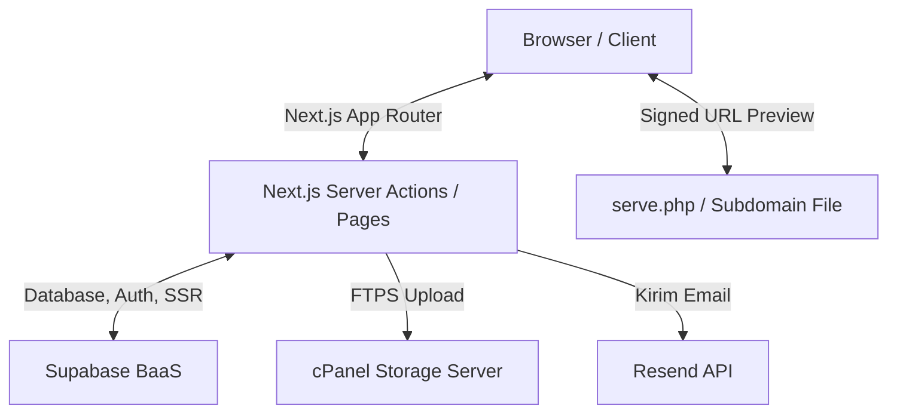

# 🏛️ Pengantar & Arsitektur Sistem

Selamat datang di dokumentasi teknis sistem **Repository Karya Tulis Ilmiah (KTI) Akademi Akupunktur Aceh**. Dokumen ini dirancang untuk membantu pengembang memahami arsitektur, struktur kode, skema database, integrasi penyimpanan, serta langkah-langkah instalasi aplikasi.

---

## 📌 Gambaran Umum

Aplikasi ini merupakan platform repositori digital untuk menyimpan, mengarsipkan, dan mempublikasikan Karya Tulis Ilmiah (KTI), Skripsi, Jurnal, dan Laporan Tugas Akhir civitas akademika Akademi Akupunktur Aceh. 

Aplikasi ini dibangun menggunakan arsitektur **Serverless Modern** berbasis Next.js App Router (React 19) dan memanfaatkan Supabase sebagai Backend-as-a-Service (BaaS) untuk database, autentikasi, serta notifikasi.

---

## 🎨 Diagram Arsitektur

Berikut adalah diagram alur data dan integrasi antar komponen di dalam sistem:

Dalam arsitektur ini:
1. **Frontend & Backend (Next.js)**: Berperan sebagai penghubung antara pengguna dengan layanan pihak ketiga secara aman melalui Server Actions (sehingga rahasia seperti API key dan credentials database tidak terekspos ke browser).
2. **Database & Autentikasi (Supabase)**: Mengelola tabel data aplikasi, otentikasi JWT pengguna, dan membatasi akses melalui *Row Level Security* (RLS).
3. **Penyimpanan Berkas (cPanel FTPS & PHP)**: Menyimpan berkas KTI (.pdf) secara privat di server cPanel hosting secara aman menggunakan protokol FTPS (FTP over SSL/TLS).
4. **Notifikasi Email (Resend)**: Mengirim surat elektronik secara otomatis kepada mahasiswa/dosen terkait status pengajuan karya mereka.

---

## 💻 Teknologi Utama

Sistem dikembangkan menggunakan tumpukan teknologi modern:

| Komponen | Teknologi | Deskripsi |
|---|---|---|
| **Core Framework** | Next.js 16.2.10 | Server-side rendering (SSR), routing, & Server Actions |
| **User Interface** | React 19.2.4 | Pembuatan antarmuka yang reaktif |
| **Styling CSS** | TailwindCSS 4.0.0 | Desain UI responsif berbasis utility-first |
| **Database & Auth** | Supabase | PostgreSQL Database & Auth management |
| **FTP Client** | basic-ftp 6.0.1 | Koneksi FTPS aman untuk upload berkas |
| **Email Service** | Resend 6.17.2 | Pengiriman notifikasi email otomatis |
| **Icons** | Lucide React | Library ikon modern |
